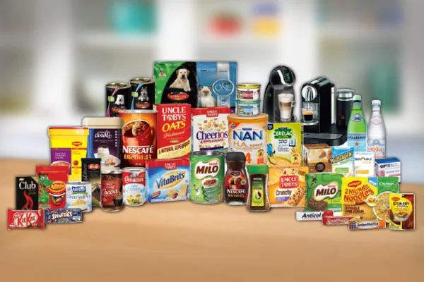
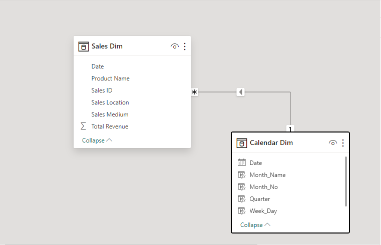
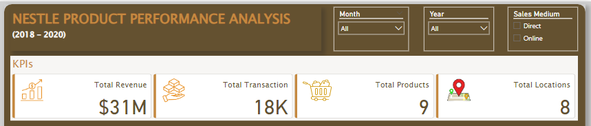
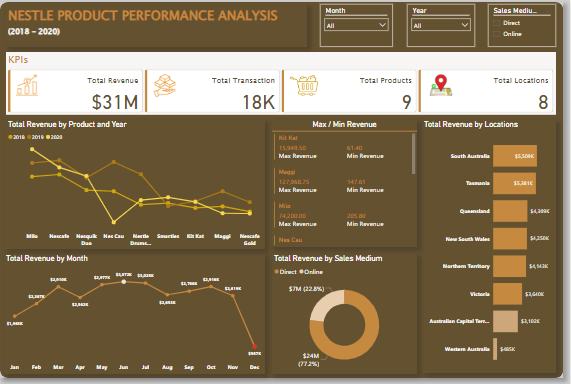

# Nestle-Product-Performance Analysis

## Objectives
- Evaluate Current Product Performance: Understand how existing products are performing in the market.
- Inform Expansion Plans: Use insights to guide decisions on introducing new product lines.
- Identify Strong and Weak Performers: Identify products with high market demand and profitability as well as those underperforming.

## Introduction
Nestlé is the largest food company in the world, marketing over 8,500 brands and 30,000 products. Nestlé is considering expanding its business by introducing new product lines. However, before doing so, there is a need to assess the performance of the current products to make informed strategic decisions.

## Data Sources
The Primary dataset used for this project is the sales data, containing detailed information about the sales made and the Products of the company

## Problem statement/ Requirement.

Nestle is looking to create some Power BI Reports to help the Growth and Strategy Department to develop a product comparison dashboard to help the company take a decision on its expansion as a company. For a start, a couple of numbers have been identified to be reported in their data as reports.

- What is the trend of total sales per product in the last 3 years?
- What is the monthly sales trend?
- Compare the different products based on the maximum and min revenue generated?
- Which location had the highest and lowest sales?
- Generate insights from the sales medium to help the Head of Growth take a decision?

## Data Transformation / Cleaning:

Data was efficiently cleaned and transformed with the Power Query Editor of Power BI. After checking all the columns and rows, they were found to be valid and devoid of empty cells and errors. The data contains 18117 rows and 6 columns.

- Making first row as headers on the data.

- Datatype then changed from 'WHOLE NUMBERS' to 'DECIMALS'.

- ADDING NEW MEASURES to calculate for the KPIS.

## Data Modelling
The best type of model in power Bi is the star schema, The calendar table was created and and relationship was created with the data. This was done help in the analysis.

## Skills Demonstrated
The following Power BI features were incorporated.

- DAX Query Function
- Modelling
- Filters

I was able to add to my skill by learning and using the **DAX Query Function**. This can be seen in the calculated **KPIS**.

## Data Analysis and Visuals

1. From our dasboard, it was observed that revenue over the past three years amounted to $31 million. 2019 emerged as the most peak year, contributing the highest total revenue of $12.6      million, Following closely, 2020 secured the second-highest position with $9.4 million in total revenue and In 2018, the revenue reached $8.7 million.
   
2. Nestle had a total number of 9 products and 8 different Locations.

## Analysis:

Here, we could discover the following insights.
1. The analysis of total sales per product over the last three years reveals the trends for each product.

- In 2018, Nescafe led with the highest revenue of $1.6M, representing 5.29% of total revenue, followed closely by Milo with $1.5M at 5.09%. Nesquik Duo contributed $1.1M, making up       3.75%, and Nes Cau accounted for 3.63% of total revenue. The least revenue was generated by Nescafe Gold.
- In 2019, Nescafe continued to dominate, achieving the highest sales of $2.1M, constituting 6.7% of total revenue. Nes Cau followed closely with $2.0M, contributing 6.53% of total        revenue, while Milo secured $1.9M, accounting for 6.43%. Nestle Drumstick generated $1.6M, representing 5.32%, and the least revenue was from Smarties.
- In 2020, Milo emerged as the leader with the highest revenue of $2.4M, making up 7.79% of total revenue. Nescafe followed with $1.8M, contributing 5.99% of total revenue. Nesquik Duo    generated $1.5M, accounting for 5.15%, and the least revenue was from Nes Cau with $173k.

2. Across all 12 Month, Total Revenue ranged from $986,986 to $3,072,412, with June accounting for 9.97% of Total Revenue, followed by July and the least is December. December performed poorly across the 3 years leading to low revenue. The factors to the decline in December could be that some products were either not produced or made available for sale. this could be as a result of customer choice during the season, brand competition, marketing strategy not well promoted, 

3. South Australia had the highest revenue location with a total of $5.5M, followed by Tasmania with $5.3M and the least is Western Australia with a total of $485k.

4. Direct sales medium had the highest transaction that occurred in the business with a total of 11,152k which had a 77% revenue generated to the business. Online sales medium had 6,963k transaction and generated 22% revenue.  

5. Maggi topped the product with the maximum revenue of 128k and the minimum revenue product is the Nescafe with 3,087

## Recommendations

- Strategic Expansion: Expand strategically to seize growth opportunities, aligning with Nestle's overall growth objectives.

- Focus on Top Performers: Concentrate efforts on top-performing products such as Milo and Nescafe, leveraging their consistent revenue contributions.

- Leverage Seasonal Peaks: Capitalize on seasonal variations, particularly in June, a consistently high-revenue month, by tailoring promotions and launches.

- Targeted Regional Marketing: Implement targeted marketing in high-revenue regions like South Australia and Tasmania to maximize market potential.

- Optimize Sales Channels: Strengthen direct sales strategies and optimize online sales approaches to enhance overall customer engagement and revenue generation.

You can interact with the dashboard  
[here](https://app.powerbi.com/view?r=eyJrIjoiY2UzNTAxMjQtNjM3NC00YzM4LTlhZDktOWNlMGYxMDU2NjkwIiwidCI6ImU3OTNmMDVhLTk5MmEtNDI4ZS1iZjZlLWVkN2FlYWI2YzU3NSJ9)

Kindly leave feedback and suggestions.

You can reach me on [Twitter](https://twitter.com/vicky_star0), [LinkedIn](www.linkedin.com/in/victoriaogwuche)

By: Victoria Ogwuche
